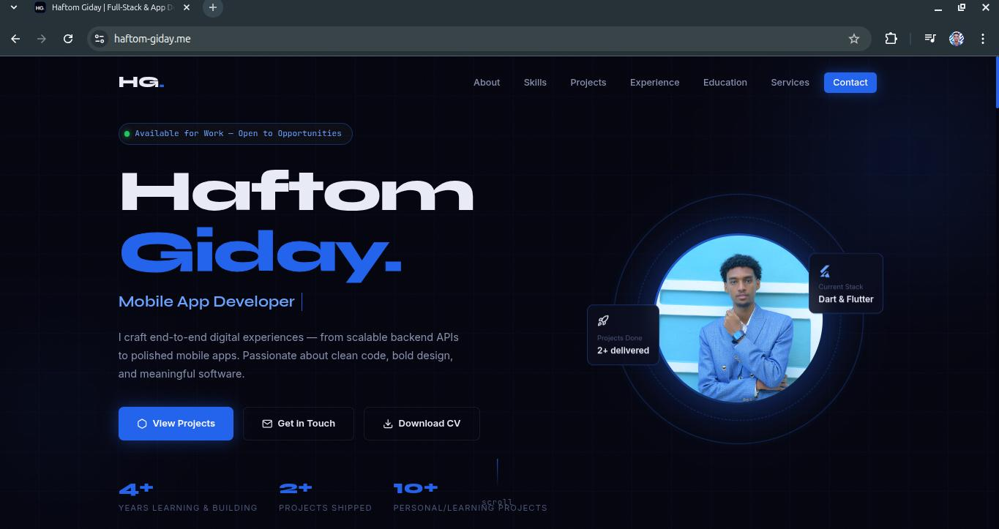

# My Personal Portfolio 

Hey! Welcome to my personal portfolio. I’m Haftom Giday, a Full-Stack and App Developer. I built this site using HTML, CSS, and JS to showcase some of the projects I've been working on, including a ride-hailing app, a movie/book tracker, and a landing page for an English language school. 



### What's inside:
- **Hero section:** A cool little intro about me with some floating tags and animations. 
- **Projects:** A few of the things I'm proud of building. 
- **Skills & Experience:** The tools I use every day (React, Flutter, Python, PostgreSQL, etc.) and my background.
- **Contact:** Links to my GitHub, LinkedIn, X, and a simple contact form. 

### How to run it yourself:
If you want to check this out on your own machine, just clone the repo and open `index.html` in your browser. If you want to run a quick local server, you can do this in your terminal:
```bash
python3 -m http.server 8000
```
Then just go to `http://localhost:8000` in your browser to see it!

### Let's connect
- [LinkedIn](https://www.linkedin.com/in/haftom-giday/)
- [GitHub](https://github.com/Haftom-Dreamer)
- [X (Twitter)](https://x.com/haftomgiday)

Feel free to reach out if you want to collaborate or just say hi!
